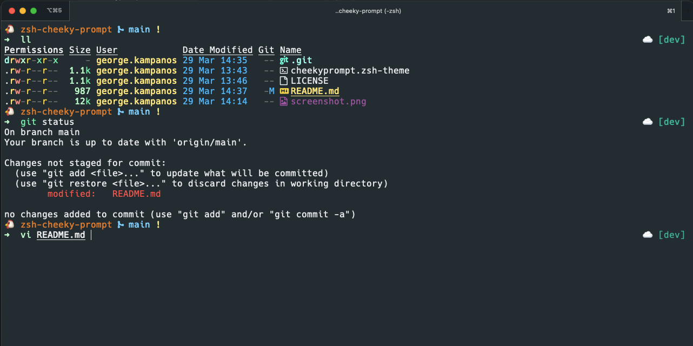

# zsh-cheeky-prompt
A simple yet effective ~theme~ prompt for your PERiTerm. Developed specifically for my day-to-day use within Nando's as I couldn't find one that covered all my needs. Hopefully, it can spice up your terminal as well 🌶️

The prompt features:
1. Chicken emoji (there isn't a Barci one yet)
1. Current working directory: Useful since most of the work is focused within the monorepo
1. Git information
1. Current Active GCP Cluster / GCP Project
1. Command input in new line

<p align="center">
    
</p>

## Installation

### zsh / oh-my-zsh
1. Download the theme in your Downloads folder
```sh
$ git clone --quiet git@github.com:kampanosg/zsh-cheeky-prompt.git ~/Downloads

```
2. Move the theme in the `oh-my-zsh` custom themes directory
```sh
$ cp ~/Downloads/zsh-cheeky-prompt/cheekyprompt.zsh-theme ~/.oh-my-zsh/custom/themes
```

3. Activate the theme in your `.zhrc`
```sh
ZSH_THEME="cheekyprompt"
```

### Config (Optional)
The theme reads an (optional) config file from the following path: `~/.config/cheeky-prompt/cluster`. 

The `cluster` file can hold the name of the cluster that it's currently active. The theme styles the right-hand-side prompt depending on the value. Alternatively, if no config is found, the theme displays the current GCP project.

**Example**
In my `.shrc`, I have an `alias` when I want to connect to any cluster. At the end of the connection sequence, I've added an `echo` command to write the current cluster to the config file. For example:

```sh
alias dev='export GOOGLE_APPLICATION_CREDENTIALS="<secret>" && ... && echo "dev" > ~/.config/cheeky-prompt/cluster'
```
